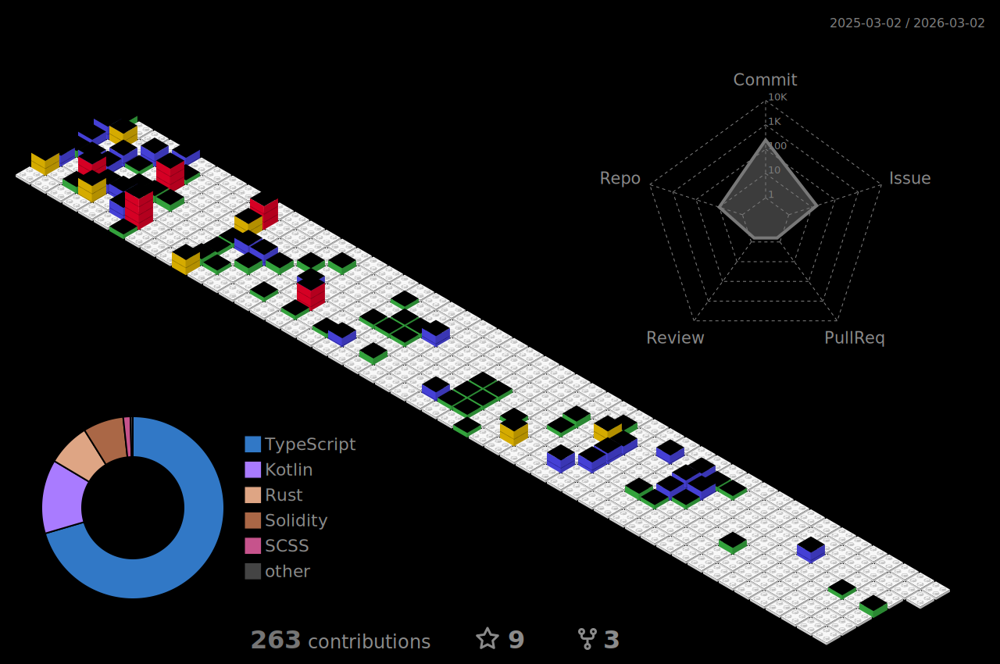

## Hi there Brates! 👋

I'm Oleh (friends call me Olich) 👱  

🧙 I love learning new stuff, programming backend services (with attention on software architecture, clean code, best practices) and automating things 🦸‍♂️

### 📈 Github Stats

   
Last year contributions (based on commits):

<!--
**olich97/olich97** is a ✨ _special_ ✨ repository because its `README.md` (this file) appears on your GitHub profile.

Here are some ideas to get you started:

- 🔭 I’m currently working on ...
- 🌱 I’m currently learning ...
- 👯 I’m looking to collaborate on ...
- 🤔 I’m looking for help with ...
- 💬 Ask me about ...
- 📫 How to reach me: ...
- 😄 Pronouns: ...
- ⚡ Fun fact: ...
-->
